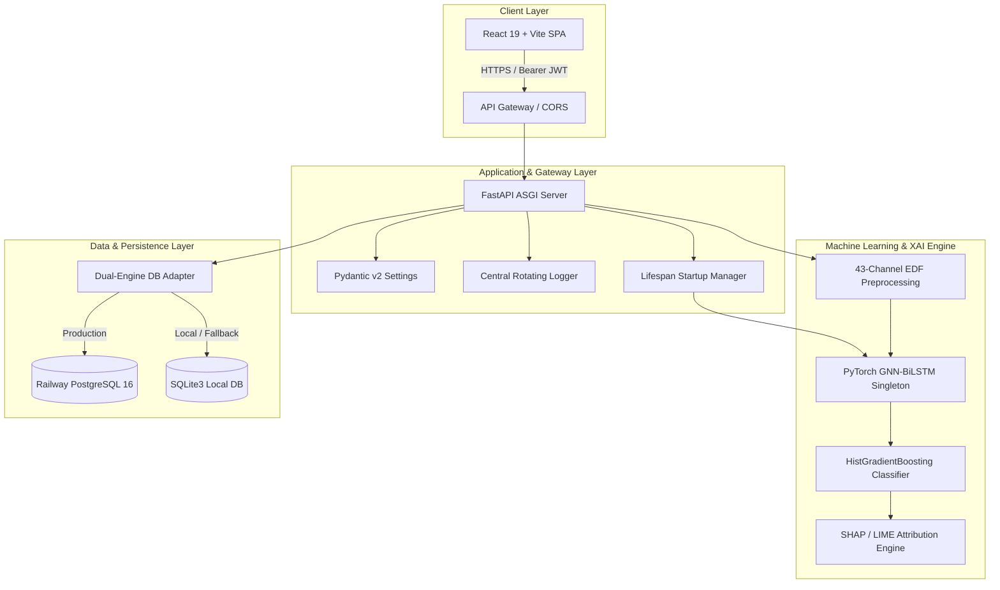

# EpiDetect AI — System Architecture

## 1. High-Level Architecture

EpiDetect AI is architected as an asynchronous, decoupled, multi-tier clinical AI platform designed for high-throughput EEG signal processing, deep learning inference, explainability attribution, and interactive visualization.

## 2. Component Breakdown

### 2.1 Frontend Client (Vercel Global Edge)
* **Framework:** React 19, Vite 8, Tailwind CSS.
* **Visualization:** Plotly.js for interactive multi-channel EEG time-series tracing; Recharts for confidence metrics and class probability distributions.
* **State Management:** React Router v7 with dynamic deep-link SPA rewrites (`/(.*) -> /index.html`).
* **Bundle Architecture:** Code-split into manual vendor chunks (`plotly-vendor`, `charts-vendor`, `icons-vendor`, `react-core`).

### 2.2 Backend Application (FastAPI on Railway Docker)
* **API Framework:** FastAPI on Python 3.11 with `uvicorn` multi-worker process manager.
* **Concurrency:** Asynchronous non-blocking file streaming with a 100MB payload guard and 30-second request timeout shield.
* **Exception Sanitization:** Global error interceptors mask internal system traces, returning sanitized RFC-7807 compliant error payloads.

### 2.3 ML Inference Pipeline
* **Spatial Feature Extraction:** 43 EEG channels processed with Butterworth bandpass (0.5–70 Hz), notch filters (50/60 Hz), and 17 statistical time/frequency features per channel ($43 \times 17 = 731$ dimensional representation).
* **Graph Convolutional Network:** Models spatial topological adjacency between electrode placements.
* **Temporal Sequence Modeling:** Bidirectional LSTM + GRU layers capture long-range temporal dependencies.
* **Classifier:** HistGradientBoosting classifier producing calibrated probabilistic predictions.

### 2.4 Persistence Layer
* **Adapter Pattern:** Seamless dual-engine database controller (`backend/database/database.py`).
* **Production Engine:** PostgreSQL 16 connection pool.
* **Development Engine:** SQLite 3 with thread-safe locking (`threading.Lock()`).
