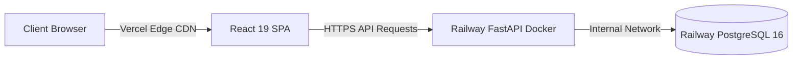

# EpiDetect AI — Production Deployment Guide

## 1. Cloud Architecture Overview

EpiDetect AI utilizes a decoupled production deployment strategy:
* **Backend:** Containerized FastAPI on **Railway** with an attached PostgreSQL 16 database.
* **Frontend:** Edge-optimized Single Page Application on **Vercel**.



## 2. Backend Deployment on Railway

### 2.1 Configuration Files
* **`Dockerfile`:** Multi-stage Python 3.11-slim container with non-root execution (`appuser:10001`).
* **`railway.json`:** Declares Dockerfile builder and failure restart policies.
* **`Procfile`:** Fallback process definition for dynamic port binding.

### 2.2 Environment Variables (Railway Dashboard)
```env
PROJECT_NAME="Epilepsy Detection API"
ENVIRONMENT="production"
JWT_SECRET="<generate-secure-32-character-random-hex-string>"
BACKEND_CORS_ORIGINS="https://your-frontend.vercel.app"
DATABASE_URL="${{Postgres.DATABASE_URL}}"
```

## 3. Frontend Deployment on Vercel

### 3.1 Project Settings (Vercel Dashboard)
* **Framework Preset:** Vite
* **Root Directory:** `frontend`
* **Build Command:** `npm run build`
* **Output Directory:** `dist`

### 3.2 Environment Variables (Vercel Dashboard)
```env
VITE_API_URL="https://your-backend.up.railway.app"
```

## 4. Local Deployment with Docker Compose

To run the full stack locally with PostgreSQL:
```bash
docker-compose up --build
```
* Backend API: `http://localhost:8000`
* PostgreSQL: `localhost:5432`
* API Docs: `http://localhost:8000/docs`
