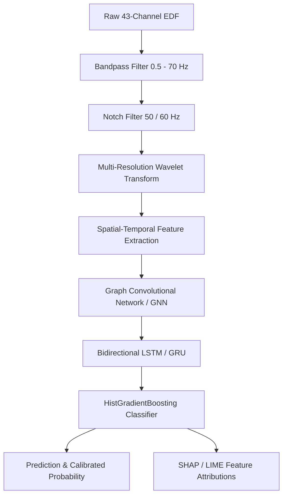

# EpiDetect AI — Machine Learning & Signal Processing Architecture

## 1. Pipeline Overview

The clinical detection pipeline processes multi-channel electroencephalogram (EEG) recordings in standard European Data Format (EDF).

## 2. Feature Extraction Matrix

For each of the 43 standard 10–20 electrode placements, 17 mathematical features are computed across time and frequency domains ($43 \times 17 = 731$ total features):
1. **Spectral Power Bands:** Delta (0.5–4 Hz), Theta (4–8 Hz), Alpha (8–13 Hz), Beta (13–30 Hz), Gamma (30–70 Hz).
2. **Signal Statistics:** Mean, Variance, Skewness, Kurtosis, Peak-to-Peak Amplitude, Root Mean Square (RMS).
3. **Non-Linear Dynamics:** Approximate Entropy (ApEn), Sample Entropy (SampEn), Spectral Entropy, Petrosian Fractal Dimension, Higuchi Fractal Dimension, Hurst Exponent.

## 3. Deep Learning Architecture

* **Spatial Adjacency:** Graph Convolutional layers model spatial diffusion across cortical regions based on inter-electrode Euclidean distance.
* **Temporal Modeling:** Two-layer Bidirectional LSTM concatenated with Bidirectional GRU captures transient paroxysmal discharge spikes.
* **Classifier:** Scikit-learn `HistGradientBoostingClassifier` trained on extracted spatio-temporal embeddings with probability calibration (Platt scaling).
* **Explainability:** SHAP (SHapley Additive exPlanations) values highlight which brain regions contributed to the final classification verdict.
