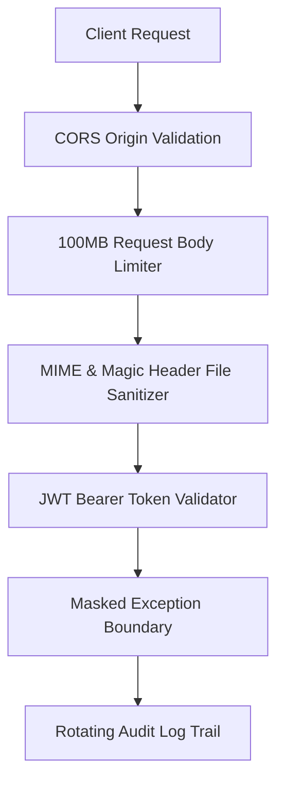

# EpiDetect AI — Security & Privacy Architecture

## 1. Threat Modeling & Attack Surface

EpiDetect AI adheres to clinical cybersecurity best practices for protected health information (PHI) and AI safety:

## 2. Security Controls

### 2.1 Error Masking & Exception Containment
* Internal unhandled exceptions do not return Python tracebacks to the client.
* Endpoints return sanitized status codes (400, 422, 500, 504) with generic messages.
* Complete tracebacks are written exclusively to `backend/logs/errors.log`.

### 2.2 Container Isolation
* Docker container executes as non-root user `appuser` (UID 10001).
* Minimal base image (`python:3.11-slim`) contains zero extraneous binaries.

### 2.3 CORS Enforcement
* Allowed browser origins are strictly restricted via `BACKEND_CORS_ORIGINS`.
* Unauthorized web origins receive HTTP 403 / CORS denial.

### 2.4 File Ingestion Safeguards
* Strict 100 MB upload ceiling prevents denial-of-service memory exhaustion.
* Temporary EDF files are created using secure OS tempfile descriptors and unlinked immediately after memory buffering.
